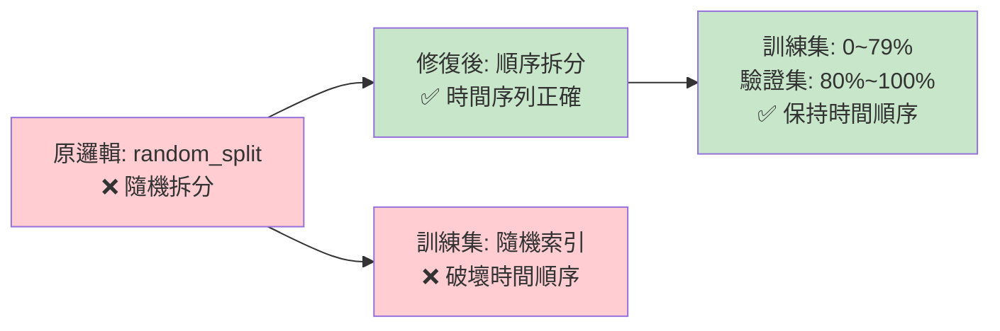

# 項目訓練流程圖

## 完整訓練流程 (從train.py開始)

```mermaid
flowchart TD
    Start([開始執行 train.py]) --> LoadConfig[加載配置 load_config]
    LoadConfig --> PrintInfo[打印實驗信息<br/>- 實驗名稱<br/>- 版本<br/>- 描述]
    PrintInfo --> LoopStart{開始批量訓練<br/>總共51個模型}
    
    %% 消費者訓練循環
    LoopStart --> ConsumerLoop[消費者循環: i=1 to 50]
    ConsumerLoop --> FormatName[格式化名稱: Consumer_XX]
    FormatName --> BuildPath[構建文件路徑<br/>data/processed/Consumer_XX.csv]
    BuildPath --> CallTrain[調用 train 函數]
    
    %% 訓練函數詳細流程
    CallTrain --> TrainStart([train 函數開始])
    TrainStart --> CreateSaveDir[創建儲存目錄<br/>runs/Consumer_XX/]
    
    %% 關鍵修復：兩階段數據集創建防止數據洩漏
    CreateSaveDir --> CreateTempDataset[階段1: 創建臨時數據集<br/>SequenceCSVDataset temp_dataset]
    CreateTempDataset --> GetSplitIndices[獲取順序拆分索引<br/>create_sequential_datasets]
    GetSplitIndices --> CreateFinalDataset[階段2: 創建正式數據集<br/>傳入 train_indices 參數]
    
    %% 數據集初始化詳細流程
    CreateFinalDataset --> DatasetInit([SequenceCSVDataset 初始化])
    DatasetInit --> ReadCSV[讀取CSV文件]
    ReadCSV --> CleanData[清理數據<br/>- 移除 Unnamed: 0<br/>- 選擇特徵]
    CleanData --> CreateSequences[創建序列對<br/>input: 96時間步<br/>target: 1時間步]
    
    %% 標準化邏輯 (關鍵修復)
    CreateSequences --> CheckTrainIndices{是否提供<br/>train_indices?}
    CheckTrainIndices -->|是| FitOnTrain[僅在訓練集上擬合標準化器<br/>防止數據洩漏]
    CheckTrainIndices -->|否| FitOnAll[在整個數據集上擬合<br/>警告: 可能數據洩漏]
    FitOnTrain --> StandardizeAll[標準化所有序列]
    FitOnAll --> StandardizeAll
    StandardizeAll --> SaveScaler[保存標準化器<br/>scalers/Consumer_XX_*_scaler.pkl]
    
    %% 模型創建
    SaveScaler --> CreateModel[創建 TransformerModel<br/>- feature_dim: 17<br/>- d_model: 256<br/>- nhead: 8<br/>- num_layers: 4]
    CreateModel --> ModelInit([TransformerModel 初始化])
    ModelInit --> SetupLayers[設置網絡層<br/>- 輸入投影層<br/>- 位置編碼<br/>- Transformer編碼器<br/>- 注意力聚合機制]
    SetupLayers --> XavierInit[Xavier權重初始化]
    
    %% 訓練器創建
    XavierInit --> CreateTrainer[創建 TransformerTrainer<br/>傳入預計算的索引]
    CreateTrainer --> TrainerInit([TransformerTrainer 初始化])
    TrainerInit --> AutoDevice[自動選擇設備<br/>CUDA/MPS/CPU]
    AutoDevice --> CreateDataLoaders[創建數據加載器<br/>使用 Subset + 順序索引]
    CreateDataLoaders --> SetupOptimizer[設置優化器<br/>- Adam優化器<br/>- 學習率調度器<br/>- MSE損失函數]
    SetupOptimizer --> SetupTensorBoard{是否啟用<br/>TensorBoard?}
    SetupTensorBoard -->|是| InitTensorBoard[初始化 TensorBoard]
    SetupTensorBoard -->|否| StartTraining
    InitTensorBoard --> StartTraining
    
    %% 訓練循環
    StartTraining([開始訓練循環])
    StartTraining --> EpochLoop{Epoch 循環<br/>max: num_epochs}
    EpochLoop --> TrainEpoch[訓練階段 train_epoch]
    
    %% 訓練階段詳細流程
    TrainEpoch --> TrainMode[模型設為訓練模式]
    TrainMode --> BatchLoop{批次循環}
    BatchLoop --> ForwardPass[前向傳播<br/>- 輸入投影<br/>- 位置編碼<br/>- Transformer編碼<br/>- 注意力聚合]
    ForwardPass --> ComputeLoss[計算MSE損失]
    ComputeLoss --> BackwardPass[反向傳播<br/>- 梯度裁剪<br/>- 優化器更新]
    BackwardPass --> NextBatch{下一個批次?}
    NextBatch -->|是| BatchLoop
    NextBatch -->|否| ValidateEpoch
    
    %% 驗證階段
    ValidateEpoch[驗證階段 validate]
    ValidateEpoch --> EvalMode[模型設為評估模式]
    EvalMode --> NoGradContext[無梯度計算]
    NoGradContext --> ValBatchLoop{驗證批次循環}
    ValBatchLoop --> ValForward[驗證前向傳播]
    ValForward --> ValLoss[計算驗證損失]
    ValLoss --> NextValBatch{下一個驗證批次?}
    NextValBatch -->|是| ValBatchLoop
    NextValBatch -->|否| LRScheduler
    
    %% 學習率調度和模型保存
    LRScheduler[學習率調度器更新]
    LRScheduler --> LogTensorBoard{TensorBoard<br/>日誌記錄?}
    LogTensorBoard -->|是| LogMetrics[記錄指標<br/>- 訓練損失<br/>- 驗證損失<br/>- 學習率]
    LogTensorBoard -->|否| CheckBestModel
    LogMetrics --> CheckBestModel
    CheckBestModel{驗證損失是否<br/>改善?}
    CheckBestModel -->|是| SaveBestModel[保存最佳模型<br/>transformer_model.pth<br/>重置patience計數器]
    CheckBestModel -->|否| IncrementPatience[增加patience計數器]
    SaveBestModel --> CheckEarlyStopping
    IncrementPatience --> CheckEarlyStopping
    CheckEarlyStopping{是否觸發<br/>早停?}
    CheckEarlyStopping -->|是| TrainingComplete
    CheckEarlyStopping -->|否| NextEpoch{下一個Epoch?}
    NextEpoch -->|是| EpochLoop
    NextEpoch -->|否| TrainingComplete
    
    %% 訓練完成後的可視化
    TrainingComplete([訓練完成])
    TrainingComplete --> PlotSummary[生成可視化圖表<br/>plot_summary]
    PlotSummary --> PlotTrainingHistory[1. 訓練歷史圖<br/>training_history.png]
    PlotTrainingHistory --> PlotPredictions[2. 預測結果圖<br/>val_predictions.png]
    PlotPredictions --> PlotPerfectPrediction[3. 完美預測圖<br/>perfect_prediction.png]
    PlotPerfectPrediction --> PlotAttentionWeights[4. 注意力權重圖<br/>attention_weights.png]
    PlotAttentionWeights --> PlotErrorAnalysis[5. 誤差分析圖<br/>error_percentage_*.png]
    
    %% 錯誤處理
    PlotErrorAnalysis --> TrainComplete[單個客戶端訓練完成]
    TrainComplete --> NextConsumer{下一個消費者?}
    NextConsumer -->|是| ConsumerLoop
    NextConsumer -->|否| PublicBuilding
    
    %% 異常處理分支
    CallTrain --> TryCatch{異常處理}
    TryCatch -->|異常| HandleError[捕獲異常<br/>打印錯誤信息<br/>繼續下一個]
    TryCatch -->|成功| TrainStart
    HandleError --> NextConsumer
    
    %% 公共建築訓練
    PublicBuilding[訓練 Public_Building]
    PublicBuilding --> PublicBuildingPath[構建路徑<br/>data/processed/Public_Building.csv]
    PublicBuildingPath --> CallTrainPublic[調用 train 函數]
    CallTrainPublic --> TryCatchPublic{異常處理}
    TryCatchPublic -->|異常| HandleErrorPublic[處理異常]
    TryCatchPublic -->|成功| TrainPublic[執行訓練流程<br/>同上述流程]
    HandleErrorPublic --> Complete
    TrainPublic --> Complete
    
    %% 完成
    Complete([=== 所有訓練完成 ===])
    
    %% 樣式定義
    classDef processClass fill:#e1f5fe,stroke:#01579b,stroke-width:2px
    classDef decisionClass fill:#f3e5f5,stroke:#4a148c,stroke-width:2px
    classDef importantClass fill:#ffebee,stroke:#b71c1c,stroke-width:3px
    classDef dataClass fill:#e8f5e8,stroke:#1b5e20,stroke-width:2px
    classDef modelClass fill:#fff3e0,stroke:#e65100,stroke-width:2px
    
    class Start,TrainStart,DatasetInit,ModelInit,TrainerInit,StartTraining,TrainingComplete,Complete processClass
    class LoopStart,CheckTrainIndices,SetupTensorBoard,EpochLoop,BatchLoop,NextBatch,ValBatchLoop,NextValBatch,LogTensorBoard,CheckBestModel,CheckEarlyStopping,NextEpoch,NextConsumer,TryCatch,TryCatchPublic decisionClass
    class CreateTempDataset,GetSplitIndices,CreateFinalDataset,FitOnTrain importantClass
    class ReadCSV,CleanData,CreateSequences,StandardizeAll,SaveScaler dataClass
    class CreateModel,SetupLayers,XavierInit,ForwardPass,ComputeLoss,BackwardPass modelClass
```



## 關鍵修復說明

### 1. 數據洩漏防護 (兩階段數據集創建)


### 2. 時間序列正確拆分



### 3. 文件輸出結構

```
項目根目錄/
├── runs/                           # 模型輸出目錄
│   ├── Consumer_01/
│   │   ├── transformer_model.pth   # 最佳模型權重
│   │   ├── training_history.png    # 訓練歷史圖
│   │   ├── val_predictions.png     # 預測結果圖
│   │   ├── perfect_prediction.png  # 完美預測圖
│   │   ├── attention_weights.png   # 注意力權重圖
│   │   ├── average_attention_weights.png
│   │   ├── error_percentage_line.png
│   │   └── error_percentage_histogram.png
│   ├── Consumer_02/
│   │   └── ... (相同結構)
│   ├── ...
│   ├── Consumer_50/
│   └── Public_Building/
├── scalers/                        # 標準化器保存目錄
│   ├── Consumer_01_feature_scaler.pkl
│   ├── Consumer_01_target_scaler.pkl
│   ├── Consumer_02_feature_scaler.pkl
│   ├── Consumer_02_target_scaler.pkl
│   ├── ...
│   ├── Public_Building_feature_scaler.pkl
│   └── Public_Building_target_scaler.pkl
├── data/
│   └── processed/                  # 輸入數據目錄
│       ├── Consumer_01.csv
│       ├── Consumer_02.csv
│       ├── ...
│       ├── Consumer_50.csv
│       └── Public_Building.csv
├── config.yaml                    # 配置文件
├── train.py                       # 主訓練腳本
└── src/                           # 源代碼目錄
    ├── DataLoader.py
    ├── Model.py
    └── Trainer.py
```

## 配置參數說明

### 模型配置
- **feature_dim**: 17 (數據特徵維度)
- **d_model**: 256 (Transformer隱藏層維度)  
- **nhead**: 8 (多頭注意力頭數)
- **num_layers**: 4 (Transformer層數)
- **dropout**: 0.1

### 數據配置
- **seq_len**: 96 (輸入序列長度)
- **normalize**: true (數據標準化)
- **scaler_type**: "minmax" (MinMaxScaler)
- **target_feature**: "Power_Demand"

### 訓練配置
- **batch_size**: 32
- **learning_rate**: 1e-4
- **train_ratio**: 0.8 (訓練集比例)
- **early_stopping_patience**: 10
- **num_epochs**: 100

## 重要改進總結

1. **✅ 修復數據洩漏**: 標準化器僅在訓練集上擬合
2. **✅ 時間序列正確性**: 改用順序拆分而非隨機拆分  
3. **✅ 可重現性**: 確定性的訓練流程
4. **✅ 錯誤處理**: 完整的異常捕獲機制
5. **✅ 可視化**: 豐富的訓練結果分析圖表
6. **✅ 配置化**: 靈活的參數配置系統